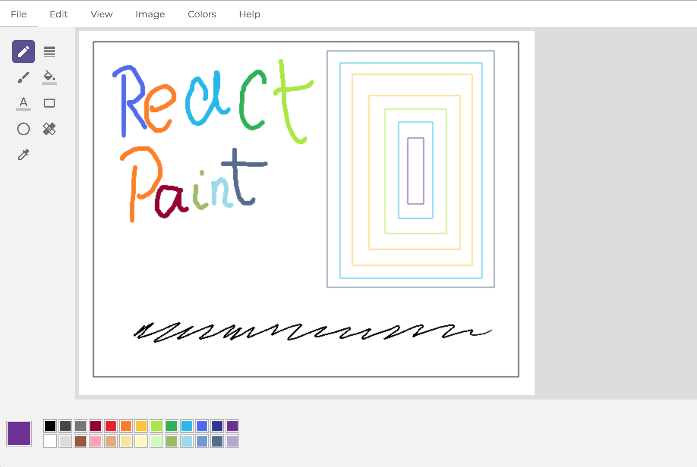

# react-paint

Overview
--------
React-paint is a small single-page graphics editing application and it's basically a MS Paint clone (in both UI and functionality). As the name suggests, it's written in React and uses HTML5 Canvas.

Features
--------
* Color selection
* Pencil tool
* Line tool
* Brush tool
* Rectangle tool

Installation 
------------
    npm install
    npm start

To-Do
-----
- [ ] Implement misssing tools (text, circle, fill, eraser)
- [ ] Implement setting different line widths and fills
- [ ] Include color picker for adding additional colors

Used libraries
--------------
* React
* PostCSS (css-next)
* Webpack
* Babel
